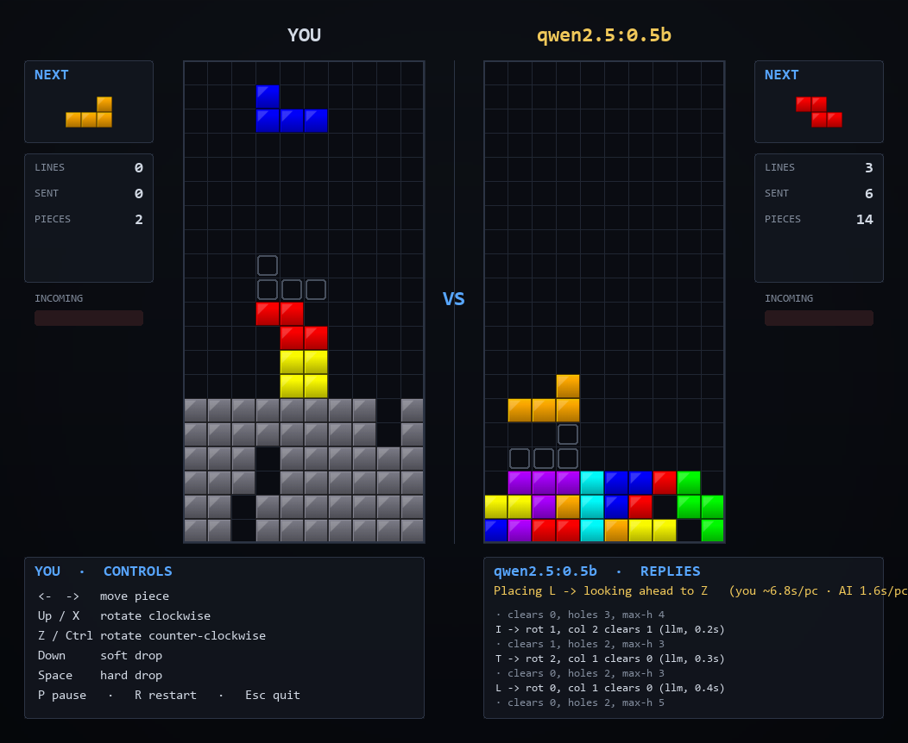

# Tetris Duel — You vs an LLM

A two-board Tetris **battle game** where you play one side and a Large Language
Model plays the other. The model isn't scripted AI — it's a real LLM that, every
turn, is handed the board state and a menu of legal moves and **chooses where to
place each piece**, then explains its reasoning in a panel under its board.

Clear lines to bury your opponent. Survive longer than the machine.



> Co-developed with **Claude** (Anthropic's Claude Code, Opus 4.x).

---

## What makes it different

This isn't "Tetris with a bot." A few things set it apart:

- **A real LLM is the opponent.** Each turn the model receives the board, the
  current and next piece, hole/height stats, and a numbered menu of legal
  placements *with the consequence of each* (lines cleared, holes added,
  resulting height). It returns its chosen move and a short reason. You watch it
  think under its board.
- **It plays continuously, not in freeze-frames.** LLMs are slow, so a naive
  version would stutter — piece, long pause, piece, long pause. Instead the game
  runs a **one-piece-ahead pipeline**: while the program animates the current
  piece into place tick-by-tick, the model is already deciding the *next* piece
  on the board as it will look after the current one lands. The animation is
  **paced to cover the model's thinking time**, so the board is always visibly
  maneuvering.
- **It matches your speed.** The AI watches how fast *you* drop pieces and tunes
  its own cadence to match — or run slightly faster — so it keeps its board
  clean and the duel stays tense instead of one side running away.
- **Garbage warfare.** Clearing N lines doesn't just score points — it dumps
  `N × 2` garbage rows onto your opponent's board from the bottom, each solid
  except a single gap. A good multi-line clear can bury the other player.
- **Works with any small local model.** The opponent runs against any
  OpenAI-compatible endpoint. The menu is presented best-candidate-first, so even
  a tiny 0.5B model plays a clean board. If the model ever stalls or replies with
  nonsense, a built-in heuristic AI makes the move so the board never freezes.
- **All art is generated.** No third-party images — the glossy block tiles and
  background are produced procedurally with Pillow on first run.

---

## Requirements

- **Python 3.10+** (developed and tested on 3.14).
- Python packages (installed via `requirements.txt`):
  - [`pygame-ce`](https://pyga.me/) — the rendering/game layer. (The *community
    edition* is used because it ships Python 3.14 wheels; classic `pygame` does
    not yet.)
  - `pillow` — procedural image generation.
  - `requests` — talking to the LLM endpoint.
- **An OpenAI-compatible chat endpoint** for the opponent (optional — you can run
  with `--no-llm` and a built-in heuristic instead). Examples: a local
  [Ollama](https://ollama.com/) server, LM Studio, vLLM, or a cloud gateway like
  OpenRouter.

---

## Install

```bash
git clone https://github.com/SixOfFive/llm_tetris.git
cd llm_tetris
pip install -r requirements.txt

# Create your local config from the example, then edit it:
copy config.example.json config.json      # Windows
# cp config.example.json config.json       # macOS/Linux
```

Open `config.json` and point `base_url` / `model` at your LLM (see
[Configuration](#configuration)). `config.json` is git-ignored, so your endpoint
stays on your machine.

> If you skip making a `config.json`, the game falls back to
> `config.example.json` (which points at `http://localhost:11434/v1`).

---

## Run

**Windows:** double-click **`play.bat`**, or from a terminal:

```bash
python run.py
```

Useful flags:

```bash
python run.py --no-llm        # opponent uses the built-in heuristic (no network)
python run.py --regen-assets  # regenerate the PNG art before starting
```

The game **starts paused** — press **P** to begin.

---

## Controls (your board is on the left)

| Key | Action |
|-----|--------|
| ← → | move piece |
| ↑ / X | rotate clockwise |
| Z / Ctrl | rotate counter-clockwise |
| ↓ | soft drop |
| **Space** | hard drop |
| **P** | pause / unpause (and start the game) |
| R | restart |
| Esc | quit |

---

## Configuration

All settings live in **`config.json`** (copied from `config.example.json`). Edit
the file and restart the game. There are two sections.

### `"llm"` — the opponent's brain

| Field | What it does |
|-------|--------------|
| `enabled` | `false` makes the opponent use the heuristic AI only (same as `--no-llm`). |
| `base_url` | The OpenAI-compatible endpoint, ending in `/v1`. **Change this to your server.** |
| `model` | Model name as the endpoint knows it, e.g. `qwen2.5:0.5b`, `qwen3:4b`, `llama3.2`. |
| `api_key` | Bearer token if your endpoint needs one; local servers usually ignore it. |
| `temperature` | Lower = more deterministic move choices. |
| `max_tokens` | Cap on the reply length. |
| `timeout_seconds` | How long to wait before falling back to the heuristic. |
| `disable_thinking` | For Qwen3-style hybrid-reasoning models, appends `/no_think` for fast replies. Leave `false` for non-reasoning models like `qwen2.5`. |

**To change which model plays**, edit `"model"` (and `"base_url"` if it's on a
different server). A bigger model plays smarter but slower; a tiny model is fast
and, thanks to the best-first move menu, still keeps a clean board.

### `"game"` — rules, speed, and feel

| Field | What it does |
|-------|--------------|
| `player_gravity_ms` | How fast your pieces fall (ms per row). Lower = harder. |
| `soft_drop_ms` | Fall speed while holding ↓. |
| `lock_delay_ms` | Grace period to nudge a piece before it locks. |
| `garbage_multiplier` | Lines sent to the opponent per line you clear (default `2`). |
| `llm_speed_factor` | How much faster than you the AI tries to play (`1.15` = ~15% faster). |
| `llm_max_cadence_ms` | Slowest the AI will go, so it keeps moving even if you idle. |
| `llm_anim_min_step_ms` / `llm_anim_max_step_ms` | Bounds on the AI's piece-animation speed. |
| `seed` | Set an integer for a repeatable piece sequence; `null` for random. |

---

## How garbage works

When you clear `N` lines at once, your opponent's board gains
`N × garbage_multiplier` rows shoved up from the bottom — each row solid except
for one shared gap column. Garbage is queued and applied just before the
receiving side's next piece spawns (so it never shoves a falling piece into a
wall). If the rising stack pushes blocks past the ceiling, that side tops out and
loses. There is no garbage cancelling — clear fast and hit back.

## How the AI opponent works

1. **Enumerate** every legal hard-drop placement of the current piece and score
   each with a classic Tetris evaluation (aggregate height, holes, bumpiness,
   lines cleared).
2. **Offer** the strongest options to the model as a numbered, best-first menu
   with each option's outcome.
3. The model **replies with an option number** and a short reason.
4. The choice is **validated** against the live board (in case incoming garbage
   changed it); if it's illegal or the model failed, the **heuristic best move**
   is used instead.
5. Meanwhile the **next** piece's request is already in flight (lookahead), and
   the animation is paced to match your tempo.

---

## Project layout

```
tetris/
  constants.py    board geometry, colours, layout, timing defaults
  pieces.py       tetromino SRS shapes, wall-kick tables, 7-bag randomizer
  board.py        grid: collision, lock, line clear, garbage insertion, metrics
  ai.py           placement enumerator + heuristic (LLM menu + fallback)
  game.py         per-side state: gravity, lock delay, garbage queue, scoring
  llm_player.py   OpenAI-compatible client, async requests, reply parsing
  assets.py       loads the generated PNGs into pygame surfaces
  renderer.py     draws boards, HUDs, reply panel, overlays
  main.py         game loop, input/DAS, the LLM controller (pipeline + tempo)
generate_assets.py    procedural Pillow art (auto-runs on first launch)
tests/smoke.py        headless logic checks (115 assertions, no window/network)
tests/capture.py      headless screenshot + live-LLM functional test
config.example.json   template config (copy to config.json)
play.bat              double-click launcher (Windows)
run.py                python entry point
```

## Tests

```bash
python tests/smoke.py            # geometry, board, garbage, enumerator, parser, full loop
python tests/capture.py --llm    # hits your real endpoint, saves preview_llm.png
python tests/capture.py          # heuristic-only screenshot, saves preview_nollm.png
```

---

## Credits

Built by [SixOfFive](https://github.com/SixOfFive), co-developed with
**Claude** (Anthropic's Claude Code, Opus 4.x). Licensed under the
[MIT License](LICENSE).
